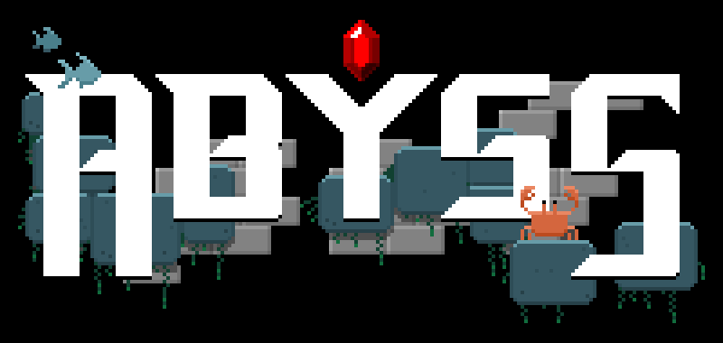
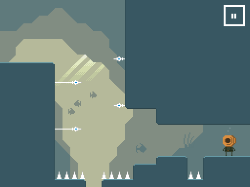

# Abyss
<div align="center"></div>

## Go down, you cannot jump, find the treasure!

Dive into the depths in search of the Great Ruby, a legendary treasure, the last vestige of an ancient forgotten civilization. Your heavy diving suit won't allow you to jump, but you have unlimited air supply!

Explore the underwater labyrinth and find your way to the deepest cave, avoiding nasty dangers and enemies through secret doors and rooms. Will you be able to find all the golden coins?

Play the game at https://mochil0.itch.io/abyss.

## What is this about?

Abyss is an adventure HTML game made with ❤️ using [Phaser](https://github.com/photonstorm/phaser) js framework. Its gameplay and visual style is inspired on classical hits and modern indie gems: from "Sonic the hedgehog" and "Metroid" to "La Mulana", "Fez" and "You have to win the game", among many others.

<div align="center"></div>

## Gameplay

Use cursor keys to move left and right (directional buttons are provided for mobile devices). Find golden coins to open secret doors and press buttons to gain access to new areas.

## How to run the game

You can use `make` to run the game (you will need `docker-compose`):

```
make run
```

Then you will be able to play at [http://localhost:1234/](http://localhost:1234/)

Alternatively, if you have `npm` installed, you can do:

```
npm install
npx parcel index.html
```

## License

This game is released under the [Mit License](https://opensource.org/licenses/MIT).

<div align="center"></div>